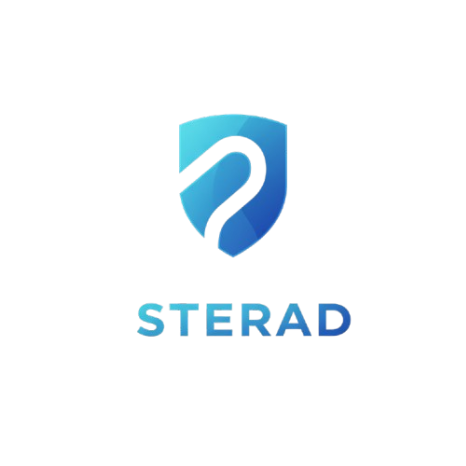

# Sterad - Secure SSR-Style Caching for SPAs

<br/>
<p align="center">
  <a href="https://github.com/codedynasty-dev/sterad">
    
  </a>
</p>

**Sterad** is an innovative server solution that brings SEO-friendly server-side rendering capabilities to single-page applications without requiring complex SSR infrastructure. By implementing a unique client-server caching mechanism, Sterad captures rendered SPA content and serves it as static HTML to search engines and subsequent visitors.

## 🌟 Features

- **SEO Optimization**: Serve fully-rendered HTML to crawlers
- **Progressive Caching**: Builds cache organically as users visit pages
- **Hybrid Caching**: Memory + disk cache with LRU eviction
- **Zero Framework Lock-in**: Works with React, Vue, Angular, and others
- **Minimal Configuration**: Simple TOML-based setup
- **Lightweight**: <5KB client script with no dependencies
- **Security Focused**: HTML sanitization and bot detection

## 🚀 Why Sterad?

Traditional SPAs face critical SEO challenges due to their client-rendered nature. While solutions exist, they come with tradeoffs:

| Solution                   | Pros                          | Cons                                  |
| -------------------------- | ----------------------------- | ------------------------------------- |
| **Static Site Generation** | Fast, SEO-friendly            | Requires rebuilds for content changes |
| **Server-Side Rendering**  | Dynamic, SEO-friendly         | Complex setup, high server load       |
| **Client-Side Rendering**  | Simple, dynamic               | Poor SEO, slow initial load           |
| **Sterad**                 | Dynamic, SEO-friendly, simple | Requires user traffic to build cache  |

Sterad bridges the gap by providing near-SSR quality for search engines while maintaining the development simplicity of pure client-side SPAs.

## ⚙️ How It Works

### Architecture Overview


### Core Components

1. **Client-Side Script**:

   - Injected into uncached SPA responses
   - Captures rendered DOM after 1 second
   - Sanitizes content by removing scripts and event handlers
   - Sends sanitized HTML to server via POST

2. **Sterad Server**:

   - Bun.js-based HTTP server
   - Hybrid caching system (memory + disk)
   - Route-based caching rules
   - HTML sanitization pipeline
   - SPA shell injection

3. **Configuration**:
   - TOML-based config file
   - Route pattern matching
   - Cache management settings

## 📦 Installation

### Prerequisites

- Bun v1.0.0 or newer
- Built SPA (production build)

### Setup Process

1. Install Sterad globally:

   ```bash
   bun add sterad
   ```

2. Create configuration file (`sterad.toml`):

   ```toml
   # Required configuration
   spa_dist = "./dist"
   port = 9081
   cache_routes = ["/*"]
   memory_cache_limit = 100

   # Optional configuration
   not_cache_routes = ["/admin/*", "/api/*"]
   ```

3. Add build script to your package.json:

   ```json
   "scripts": {
     "build": "vite build",
     "start": "sterad"
   }
   ```

4. Start the server:
   ```bash
   bun run start
   ```

## 🔧 Configuration

Sterad uses a TOML configuration file with the following options:

| Key                    | Required | Default                | Description                                  |
| ---------------------- | -------- | ---------------------- | -------------------------------------------- |
| **spa_dist**           | Yes      | -                      | Path to SPA build directory                  |
| **port**               | Yes      | -                      | Server port                                  |
| **cache_routes**       | Yes      | -                      | Route patterns to cache (supports wildcards) |
| **memory_cache_limit** | Yes      | -                      | Maximum in-memory cache entries              |
| **not_cache_routes**   | No       | []                     | Routes to exclude from caching               |
| **cache_dir**          | No       | spa_dist/.sterad_cache | Custom cache directory                       |
| **sanitization_level** | No       | "strict"               | HTML sanitization level                      |

### Route Pattern Examples

```toml
# Cache all routes
cache_routes = ["/*"]

# Cache only product pages
cache_routes = ["/products/*", "/categories/*"]

# Exclude admin routes
not_cache_routes = ["/admin/*", "/dashboard"]
```

## 🛡️ Security Model

Sterad implements multiple security layers to prevent XSS and malicious content injection:

1. **Client-Side Sanitization**:
   - Removes all `<script>` tags
   - Removes event handlers (`onclick`, `onload`, etc.)
   - Disables `javascript:` URIs
2. **Server-Side Sanitization**:
   - Removes all `<script>` and `<style>` tags
   - Removes event handlers (`onclick`, `onload`, etc.)
   - Disables `javascript:` URIs

## 📊 Performance

Sterad is optimized for high performance with:

- **Hybrid Caching**:

  - Hot-requests served from memory
  - Warm storage on disk
  - LRU eviction policy
  - Non-Blocking I/O:

## 🌐 Deployment

### Docker Deployment

```dockerfile
FROM oven/bun:1.0

WORKDIR /app
COPY . .
RUN bun install

CMD ["bun", "run", "start"]
```

Build and run:

```bash
docker build -t sterad-app .
docker run -p 9081:9081 sterad-app
```

## 🚨 Current Limitations

1. **Initial Cache Population**:

   - Requires real user traffic to build cache
   - First crawler visit might receive unstyled content

2. **Dynamic Content**:

   - Time-sensitive content may become stale

3. **Framework Constraints**:

   - Requires specific root element selectors
   - Invalidates automatically when cached page is reloaded

4. **Security Model**:
   - Not suitable for user-generated content
   - Limited tests for protection against advanced XSS vectors

## 🛠 Troubleshooting

### Common Issues

**Cache not updating:**

1. Check hard reload handling

**Content not captured:**

1. Verify root element matches these selectors:
   ```js
   const selectors = [
     '[data-wrapper="app"]',
     "#root",
     "#app",
     "#__next",
     '[role="main"]',
   ];
   ```
2. Check for CSP conflicts

**Performance options:**

1. Adjust memory cache size:
   ```toml
   memory_cache_limit = 200
   ```
2. Exclude static assets:
   ```toml
   not_cache_routes = ["/static/*"]
   ```

## 🚧 Contributing

We welcome contributions! Please follow these steps:

1. Fork the repository
2. Create a feature branch:
   ```bash
   git checkout -b feat/awesome-feature
   ```
3. Commit your changes:
   ```bash
   git commit -m "feat: implement awesome feature"
   ```
4. Push to your branch:
   ```bash
   git push origin feat/awesome-feature
   ```
5. Open a pull request

### Development Setup

```bash
# Clone repository
git clone https://github.com/your/sterad.git

# Install dependencies
bun install

# Run in development mode
bun run dev

# Run tests
bun run test
```

For support, contact hello@codedynasty.dev.

## 📞 Support

For information, visit [Codedynasty](https://codedynasty.dev) or email hello@codedynasty.dev.

---

**Codedynasty** © 2022-present, Codedynasty Contributors.
